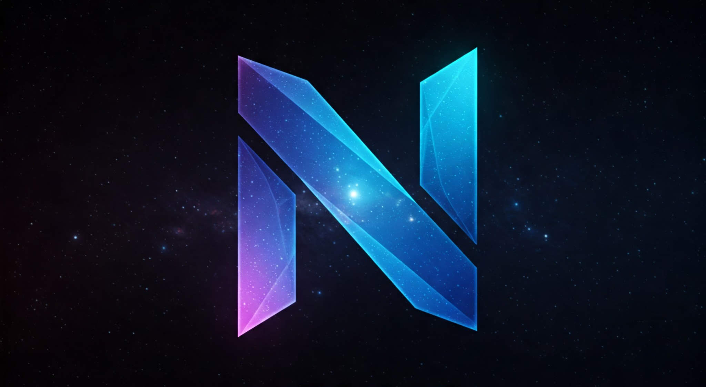

# NEXUS Framework



A battle-tested collection of game-ready plugins for Unreal Engine. The **NEXUS** Framework offers commonly used patterns and opinionated solutions for various areas of game development.


## Getting Started

Go read the [documentation](https://docs.google.com/document/d/12IpriZXgPKLbOO80c9wkD5uY-Q_9e2lagb-SIDg31Bk/#heading=h.k501g8du8nij)! **\</fullstop\>**

## License

````log
Boost Software License - Version 1.0 - August 17th, 2003

Permission is hereby granted, free of charge, to any person or organization
obtaining a copy of the software and accompanying documentation covered by
this license (the "Software") to use, reproduce, display, distribute,
execute, and transmit the Software, and to prepare derivative works of the
Software, and to permit third-parties to whom the Software is furnished to
do so, all subject to the following:

The copyright notices in the Software and this entire statement, including
the above license grant, this restriction and the following disclaimer,
must be included in all copies of the Software, in whole or in part, and
all derivative works of the Software, unless such copies or derivative
works are solely in the form of machine-executable object code generated by
a source language processor.

THE SOFTWARE IS PROVIDED "AS IS", WITHOUT WARRANTY OF ANY KIND, EXPRESS OR
IMPLIED, INCLUDING BUT NOT LIMITED TO THE WARRANTIES OF MERCHANTABILITY,
FITNESS FOR A PARTICULAR PURPOSE, TITLE AND NON-INFRINGEMENT. IN NO EVENT
SHALL THE COPYRIGHT HOLDERS OR ANYONE DISTRIBUTING THE SOFTWARE BE LIABLE
FOR ANY DAMAGES OR OTHER LIABILITY, WHETHER IN CONTRACT, TORT OR OTHERWISE,
ARISING FROM, OUT OF OR IN CONNECTION WITH THE SOFTWARE OR THE USE OR OTHER
DEALINGS IN THE SOFTWARE.
````

## Documentation

We've elected to utilize [Google Docs](http://nexus.dotbunny.com/) to house the documentation for the **NEXUS** Framework. This way it is easy to read, search and most importantly **author**.

*Let's not kid ourselves...* We are all a little lacking in documenting our work area, so this is our best bet at creating a spot to collate formalized documentation. Code documentation should still be present to mark up methods and other elements. 
