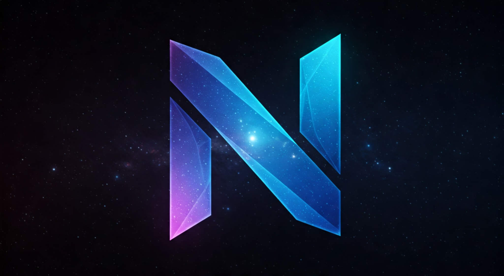

# NEXUS Framework



A battle-tested collection of game-ready plugins for Unreal Engine. The **NEXUS** Framework offers commonly used patterns and opinionated solutions for various areas of game development.

Built for Unreal Engine **5.8** in modern C++, and used in production by the games built on it.

## Getting Started

Go read the [documentation](https://nexus-framework.com)! **\</fullstop\>**

Fine, the short version: clone this repository into your project's `Plugins/` folder, enable the plugins you want, and follow [Getting Started](https://nexus-framework.com/guides/getting-started) for the details.

## The Plugins

| Plugin | What It Does | Docs |
| :-- | :-- | :-- |
| **Core** | The shared foundation: math and seeded random, ranges, collections, raw-mesh tools, developer reporting and object snapshots, PCG elements. Every other plugin depends on it. | [Core](https://nexus-framework.com/docs/core/) |
| **Actor Pools** | Pool actors instead of spawning and destroying them: prewarming, spawner components, kill zones and Blueprint async actions. | [Actor Pools](https://nexus-framework.com/docs/actor-pools/) |
| **Blockout** | Meshes and materials for blocking out a level: walls, parapets, barriers, primitives, grids and debug colors. Almost entirely content. | [Blockout](https://nexus-framework.com/docs/blockout/) |
| **Dynamic References** | A service locator for actors: register them under a reference and look up everything registered there, without hard dependencies between them. | [Dynamic References](https://nexus-framework.com/docs/dynamic-references/) |
| **Guardian** | Watches the live `UObject` count and snapshots and diffs it when it climbs, so leaks announce themselves. | [Guardian](https://nexus-framework.com/docs/guardian/) |
| **Picker** | Generates points in and on shapes (circle, arc, rectangle, box, sphere, spline), optionally projected onto collision or the navmesh, with seeded determinism. | [Picker](https://nexus-framework.com/docs/picker/) |
| **Tooling** | Editor-only improvements: Texture Packer, Multiplayer Test, Selection Lock, validators, collision visualizer, leak check and more. | [Tooling](https://nexus-framework.com/docs/tooling/) |
| **UI** | UMG/CommonUI components, widgets and helpers, including list views, developer overlays, and safe streaming of 3D text. | [UI](https://nexus-framework.com/docs/ui/) |
| **World Assembly** | Procedural level assembly from hand-authored cells: organs, tissues, junctions, deterministic seeds, and multiplayer-aware streaming. | [World Assembly](https://nexus-framework.com/docs/world-assembly/) |

Each plugin folder has its own short README listing what it depends on.

## Repository Layout

| Folder | Contents |
| :-- | :-- |
| `Plugins/` | The framework itself, one folder per plugin. |
| `Samples/` | Optional `NEXUS Samples: …` plugins with demo maps for each system. Enable them from `Edit > Plugins`. |
| `TestProject/` | The project the framework is developed and tested in, with the functional-test maps. |
| `SourceAssets/` | Source art for icons and editor resources. |
| `CHANGELOG.md` | What changed in each release. The same content is published at [What's New](https://nexus-framework.com/whats-new/changelog). |

## Contributing

Issues and pull requests are welcome. Start with [Contributing](https://nexus-framework.com/community/contributing) and the [Coding Standard](https://nexus-framework.com/community/coding-standard).

## License

````log
Boost Software License - Version 1.0 - August 17th, 2003

Permission is hereby granted, free of charge, to any person or organization
obtaining a copy of the software and accompanying documentation covered by
this license (the "Software") to use, reproduce, display, distribute,
execute, and transmit the Software, and to prepare derivative works of the
Software, and to permit third-parties to whom the Software is furnished to
do so, all subject to the following:

The copyright notices in the Software and this entire statement, including
the above license grant, this restriction and the following disclaimer,
must be included in all copies of the Software, in whole or in part, and
all derivative works of the Software, unless such copies or derivative
works are solely in the form of machine-executable object code generated by
a source language processor.

THE SOFTWARE IS PROVIDED "AS IS", WITHOUT WARRANTY OF ANY KIND, EXPRESS OR
IMPLIED, INCLUDING BUT NOT LIMITED TO THE WARRANTIES OF MERCHANTABILITY,
FITNESS FOR A PARTICULAR PURPOSE, TITLE AND NON-INFRINGEMENT. IN NO EVENT
SHALL THE COPYRIGHT HOLDERS OR ANYONE DISTRIBUTING THE SOFTWARE BE LIABLE
FOR ANY DAMAGES OR OTHER LIABILITY, WHETHER IN CONTRACT, TORT OR OTHERWISE,
ARISING FROM, OUT OF OR IN CONNECTION WITH THE SOFTWARE OR THE USE OR OTHER
DEALINGS IN THE SOFTWARE.
````

## Badges

### Static Analysis (SonarQube)
[](https://sonarcloud.io/summary/overall?id=dotBunny_NEXUS&branch=main)
[](https://sonarcloud.io/summary/overall?id=dotBunny_NEXUS&branch=main)
[](https://sonarcloud.io/summary/overall?id=dotBunny_NEXUS&branch=main)
[](https://sonarcloud.io/summary/overall?id=dotBunny_NEXUS&branch=main)
[](https://sonarcloud.io/summary/overall?id=dotBunny_NEXUS&branch=main)
[](https://sonarcloud.io/summary/overall?id=dotBunny_NEXUS&branch=main)
